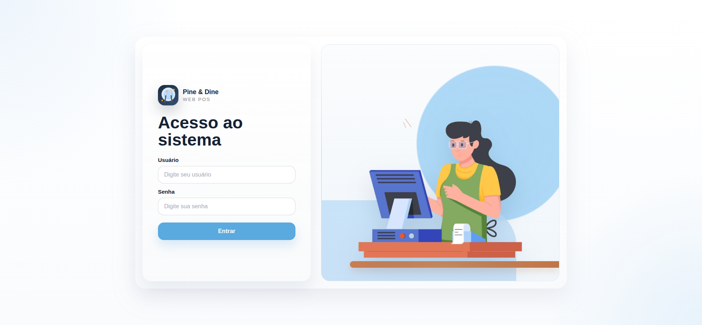
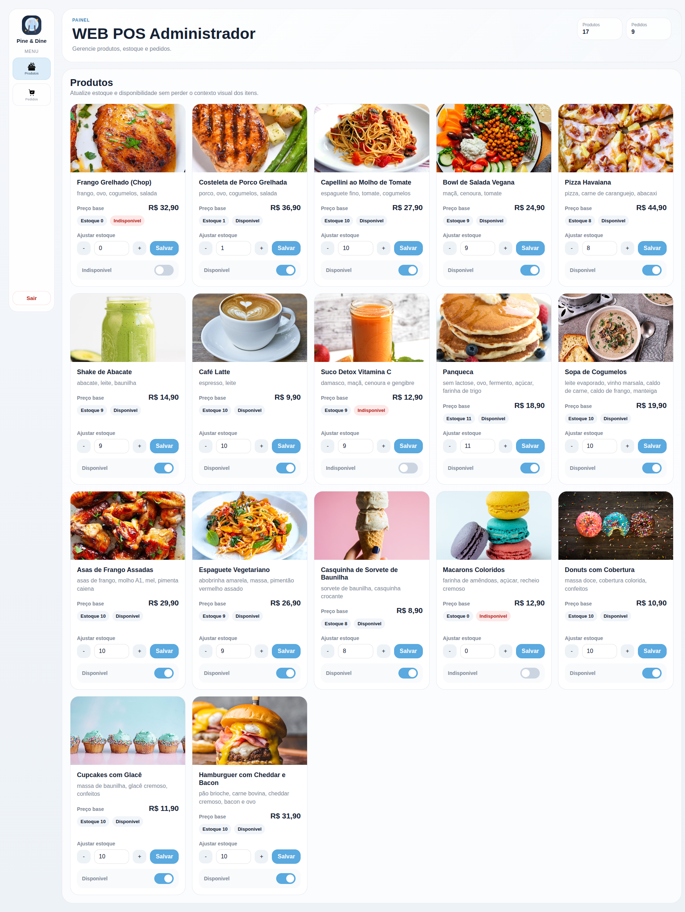
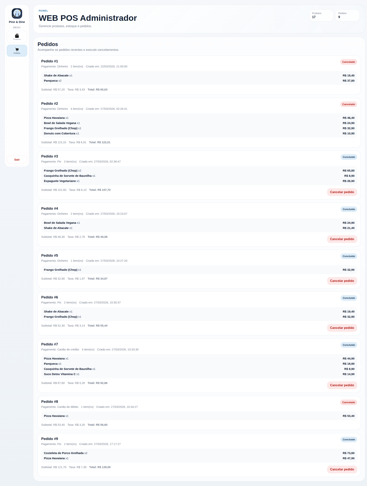
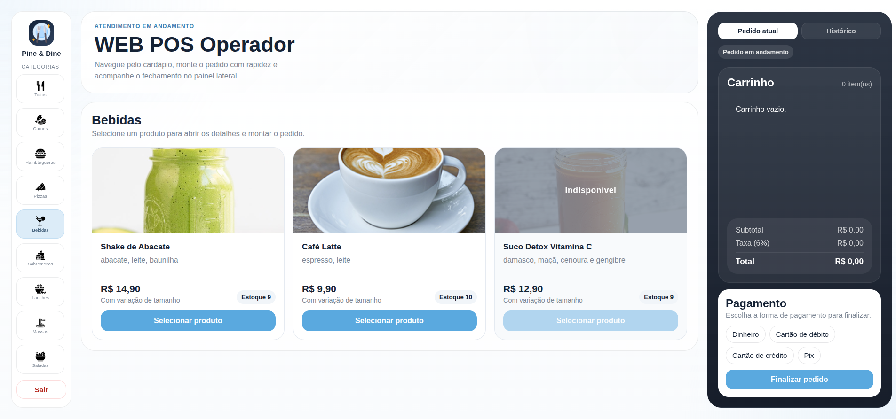

# Web POS Frontend

Frontend do sistema POS web construído com React, TypeScript e Vite.

## Telas da aplicação

Uma prévia das principais interfaces do sistema:

<table>
  <tr>
    <td align="center" width="50%">
      <strong>Login</strong>
      <br />
      
    </td>
    <td align="center" width="50%">markdow
      <strong>Painel do administrador</strong>
      <br />
      
    </td>
  </tr>
  <tr>
    <td align="center" width="50%">
      <strong>Pedidos do administrador</strong>
      <br />
      
    </td>
    <td align="center" width="50%">
      <strong>Categorias do operador</strong>
      <br />
      
    </td>
  </tr>
</table>

## Executando localmente

Pré-requisitos:

- Node.js 20.19 ou superior
- npm

Antes de instalar ou executar o projeto, garanta que o terminal esteja usando a versão correta do Node:

```bash
cd web-pos
nvm use
```

Se preferir informar explicitamente a versão:

```bash
nvm use 20.19.0
```

Passos:

```bash
cd frontend
npm install
npm run dev
```

Aplicação local:

- em `http://localhost:8080`
- se a porta padrão estiver ocupada, o Vite usará a próxima porta disponível e mostrará a URL no terminal

## Scripts úteis

```bash
npm run dev
npm run build
npm run preview
npm run lint
```

## Firebase

O passo inicial de integração com Firebase já está preparado no frontend.

Arquivos principais:

- `frontend/.env.example`
- `frontend/src/application/firebase/firebase-env.ts`
- `frontend/src/application/firebase/firebase-app.ts`
- `frontend/src/application/firebase/firebase-services.ts`

Para configurar localmente:

1. crie um arquivo `frontend/.env.local`
2. copie as chaves de `frontend/.env.example`
3. preencha com os dados do seu projeto Firebase

Variáveis esperadas:

```bash
VITE_FIREBASE_API_KEY=
VITE_FIREBASE_AUTH_DOMAIN=
VITE_FIREBASE_PROJECT_ID=
VITE_FIREBASE_STORAGE_BUCKET=
VITE_FIREBASE_MESSAGING_SENDER_ID=
VITE_FIREBASE_APP_ID=
VITE_FIREBASE_ADMIN_EMAILS=
VITE_FIREBASE_OPERATOR_EMAILS=
```

Observações:

- a inicialização do Firebase é lazy, ou seja, só acontece quando algum serviço for usado
- sem variáveis configuradas, o projeto continua podendo evoluir sem quebrar a aplicação inteira
- os próximos passos vão conectar `Authentication`, `Firestore` e `Storage` aos fluxos reais do sistema
- os perfis de acesso sao definidos pelos e-mails autorizados para admin e operador
