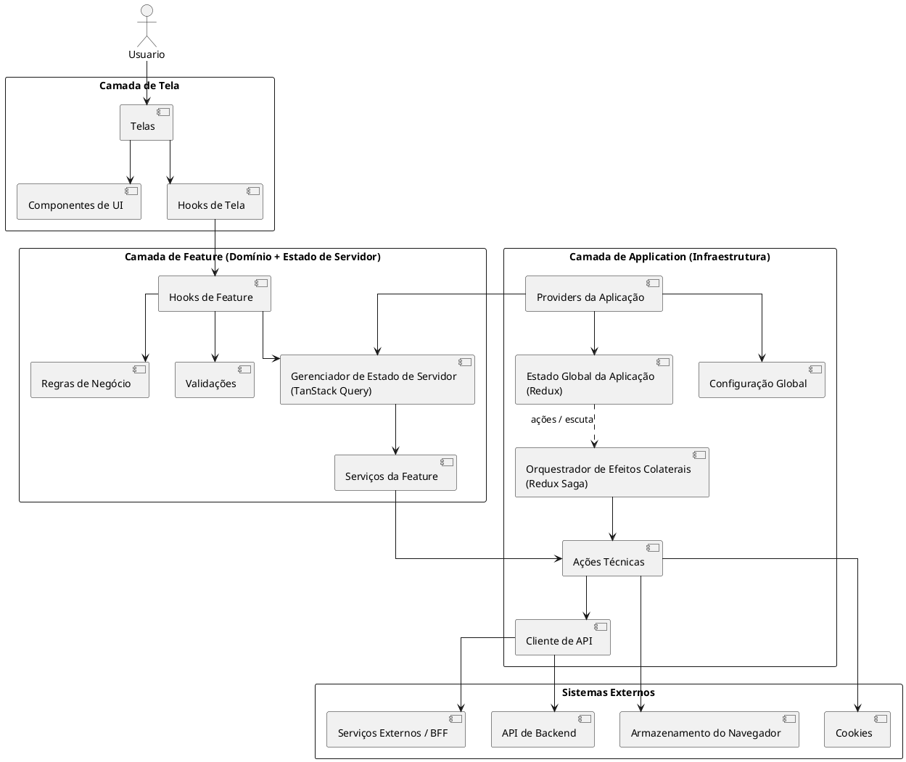
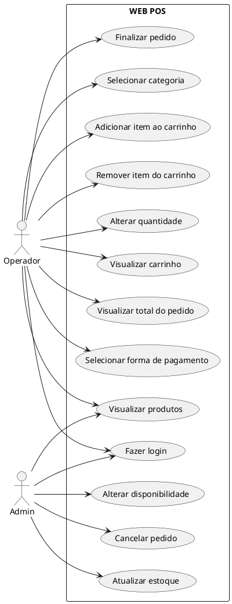
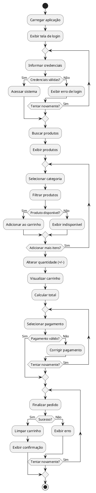
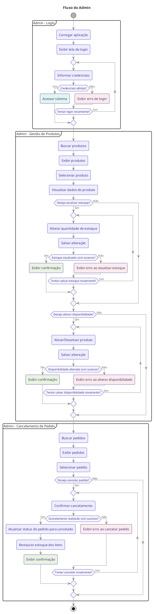

# 🧾 WEB POS

## 📌 Visão Geral

Sistema de ponto de venda (POS) com dois perfis:

- Operador: responsável pela venda
- Admin: responsável pela gestão de produtos

---

## 🏗️ Diagrama de Arquitetura

---

## 🎭 Diagrama de Caso de Uso

---

## 🔄 Fluxo do Operador

---

## ⚙️ Fluxo do Admin

---

## ✅ Conclusão

- Arquitetura em camadas respeitada
- Separação clara entre Admin e Operador
- Fluxos com retorno de erro
- Coerente com MVP de POS
